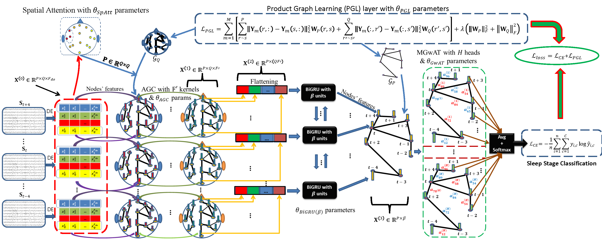

# ProductGraphSleepNet
This repository implements the proposed ProductGraphSleepNet via TensorFlow and Keras. In the case of using our codes, kindly please consider citing the following paper. 

[Einizade, Aref, Samaneh Nasiri, Sepideh Hajipour Sardouie, and Gari Clifford. "ProductGraphSleepNet: Sleep Staging using Product Spatio-Temporal Graph Learning with Attentive Temporal Aggregation." arXiv preprint arXiv:2212.04881 (2022).](https://arxiv.org/abs/2212.04881)

Note that some parts of the codes in the current repository are partially inspired by the following repositories. Therefore, in the case of using our codes, kindly please consider citing them, too.

https://github.com/ziyujia/GraphSleepNet

https://github.com/danielegrattarola/keras-gat

## Reproduce the results on the public Montreal Archive of Sleep Studies (MASS)-SS3 database:

Step 1: Download the raw .edf files ("* Base.edf" and "* PSG.edf") of the MASS-SS3 database from the following link and put them in the "MASS SS3 raw edf" folder.

http://ceams-carsm.ca/en/mass/

Step 2: Run `MASS_SS3_process.py` to generate the feature extracted file (i.e., "MASS_SS3_DE_16folds.npz").

Step 3: Run `MASS_SS3_Train_Test.py` to reproduce the classification results and generate the learned temporal (i.e., "MASS_SS3_LearnedGraphsTempral.npy") and spatial (i.e., "MASS_SS3_LearnedGraphsSpatial.npy") graphs.

## Reproduce the results on the public SleepEDF database:

Step 1: Download the raw .edf files, convert them (PSG signals and their labels) to .mat files ("* -PSG.mat" with two keys "record" and "Labels") of the SleepEDF database from the following link and put them in the "SleepEDF20 raw mat" folder.

https://www.physionet.org/content/sleep-edfx/1.0.0/

Step 2: Run `SleepEDF20_process.py` to generate the feature extracted file (i.e., "SleepEDF20_DE_20Folds.npz").

Step 3: Run `SleepEDF20_Train_Test.py` to reproduce the classification results.

## Descriptions of the provided files:

In the following, brief descriptions of all provided files are given:
- `ProductGraphSleepNet.py`: implements the proposed ProductGraphSleepNet described in the paper.
- `DE_PSD.py`: a function to calculate the Differential Entropy (DE) and Power Spectral Density (PSD) features 
- `graph_attention_layer.py`: a custom layer implementing the Graph-wise Attention (GwAT) module described in the paper
- `MASS_SS3.config` and `SleepEDF20.config`: config files to set hyperparameters and training parameters. Note that if "use_pretrained" is set to "True", the program only generates the results from pre-trained models. If "use_pretrained" is set to "False", the program trains the models entirely on the feature-extracted files.
- `MASS_SS3_process.py` and `SleepEDF20_process.py`: extracting and saving DE features from raw MASS-SS3 or SleepEDF databases.
- `MASS_SS3_DataGenerator.py` and `SleepEDF20_DataGenerator.py`: splitting the data into Cross-Subject Cross-Validation sections.
- `MASS_SS3_Utils.py` and `SleepEDF20_Utils.py`: helpful functions to visualize the results
- `MASS_SS3_Train_Test.py` and `SleepEDF20_Train_Test.py`: reproduce the results and generate the learned spatial and temporal graphs.
- `ChanLocs_and_ChanNames.mat`: locations of the EEG electrodes for visualizing the spatial graphs
- `Plot_learned_Spatial_Temporal_Graphs.m`: a MATLAB file to plot the learned graphs

The provided codes have been written in the following settings:

- Matplotlib==3.0.2       
- Numpy==1.19.5      
- Scipy==1.1.0       
- Keras==2.2.4       
- Tensorflow==1.10.0      
- TensorFlow-gpu==1.12.0      
- sklearn==0.0 
- mne==0.19.2               
- MATLAB==2018b

